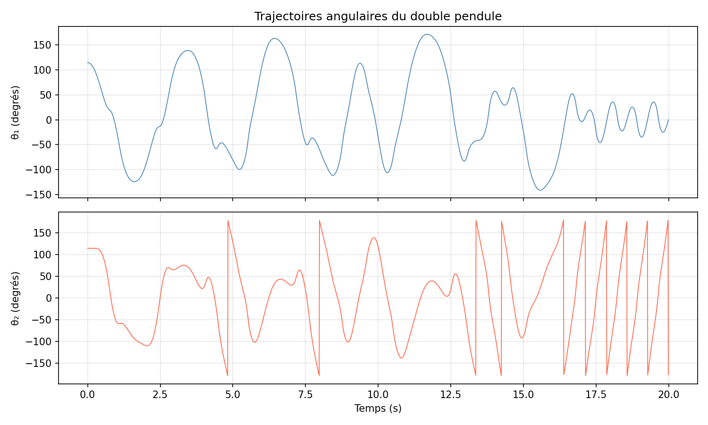
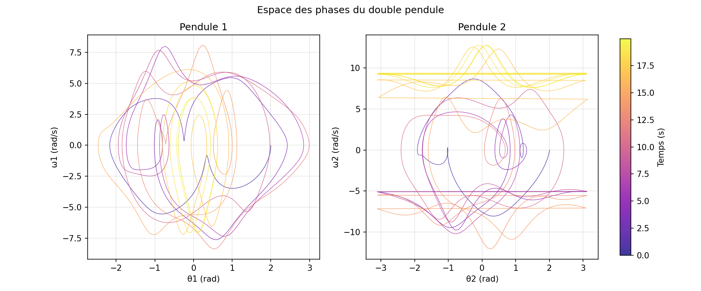
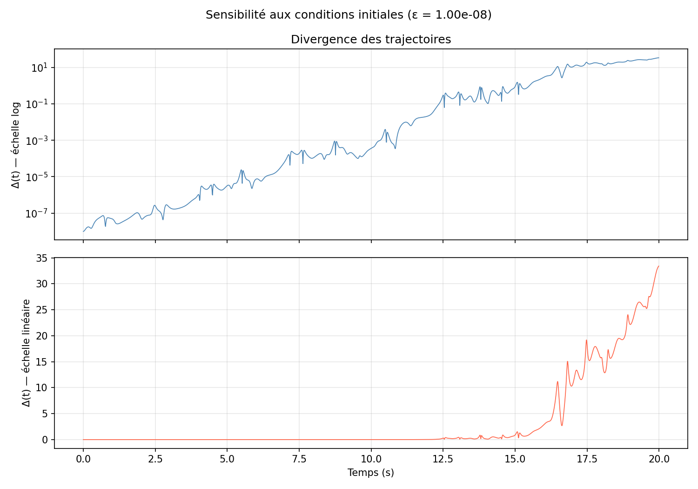
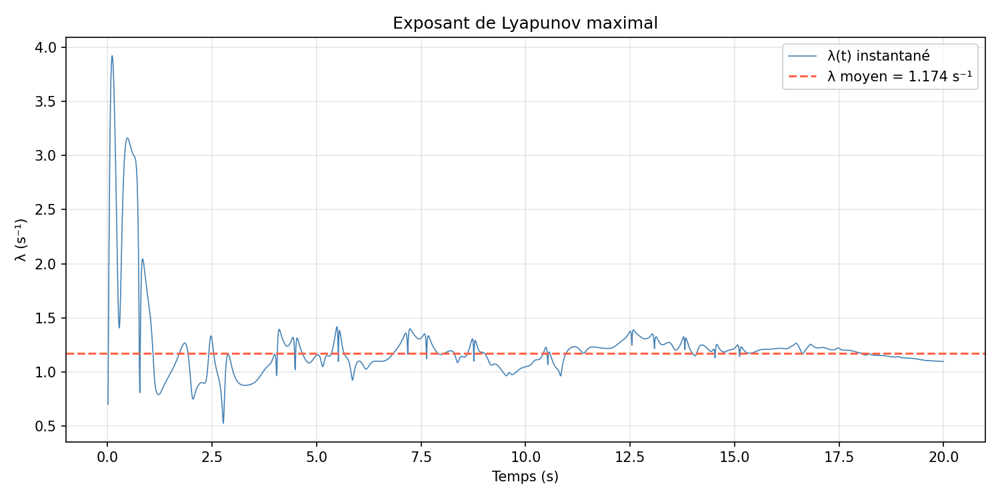

# Double Pendulum Simulation

Numerical simulation and chaotic dynamics analysis of a double pendulum, implemented in Python with NumPy, SciPy, and Matplotlib. The project covers the full pipeline from Lagrangian mechanics to chaos diagnostics, including Lyapunov exponent estimation and trajectory divergence visualization.

## Features

- **Physics engine** — `DoublePendulum` class with Lagrangian equations of motion, high-precision RK45 integrator (rtol = atol = 1e-9), and total mechanical energy computation
- **Trajectory visualization** — angular displacement time series and pendulum animation (GIF)
- **Phase space** — (θ, ω) portraits colored by time for both pendulum arms
- **Sensitivity to initial conditions** — divergence of two trajectories starting ε apart, shown on log and linear scales
- **Lyapunov exponent** — running estimate of the maximal Lyapunov exponent; converges to λ ≈ 1.17 s⁻¹ for the default chaotic initial conditions (θ₁ = θ₂ = 2.0 rad)
- **Chaos divergence** — side-by-side comparison of angle time series and spatial trajectories of the second mass
- **Test suite** — 14 pytest tests covering physics correctness, energy conservation, and visualization output

## Generated figures

Running the demo script produces the following outputs in `figures/`:

| File | Description |
|------|-------------|
| `animation.gif` | Real-time animation of the pendulum motion |
| `angles.png` | θ₁(t) and θ₂(t) over time |
| `phase_space.png` | Phase portraits (ω vs θ) with time colormap |
| `sensitivity.png` | Trajectory divergence on log and linear scales |
| `lyapunov.png` | Running Lyapunov exponent estimate |
| `chaos_divergence.png` | Angle time series and spatial paths for two diverging trajectories |









## Installation

```bash
git clone https://github.com/simont14/double_pendulum_sim.git
cd double_pendulum_sim
python -m venv .venv
# Windows
.venv\Scripts\activate
# macOS / Linux
source .venv/bin/activate
pip install -r requirements.txt
```

## Quick start

```bash
python notebooks/run_simulation.py
```

This runs a 20-second simulation with θ₁ = θ₂ = 2.0 rad (chaotic regime) and writes all six figures to `figures/`.

## Physics

The equations of motion are derived from the Lagrangian of the system and expressed as a coupled system of four first-order ODEs in (θ₁, θ₂, ω₁, ω₂). In the large-angle regime the system is deterministic but chaotic: two trajectories separated by ε = 10⁻⁸ rad diverge exponentially with a positive Lyapunov exponent, making long-term prediction impossible.

## Project structure

| Path | Role |
|------|------|
| `src/pendulum.py` | `DoublePendulum` class — equations of motion, integrator, energy |
| `src/chaos.py` | `trajectory_divergence`, `lyapunov_exponent` |
| `src/visualization.py` | All plotting and animation functions |
| `notebooks/run_simulation.py` | Demo script — runs simulation and saves all figures |
| `tests/` | pytest test suite |
| `figures/` | Output figures (committed) |

## Running tests

```bash
pytest tests/
```

All 14 tests should pass. The suite covers default and custom parameters, equilibrium conditions, energy conservation (relative error < 10⁻⁶ over 10 s), and smoke tests for all visualization functions.

## License

MIT
